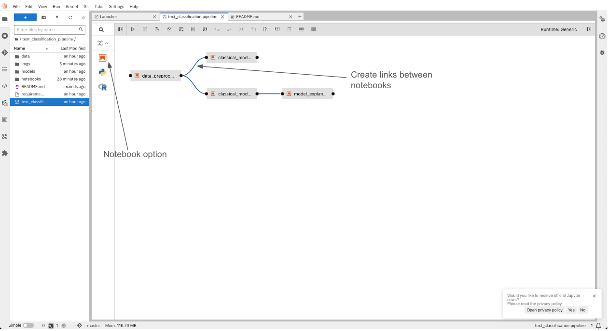
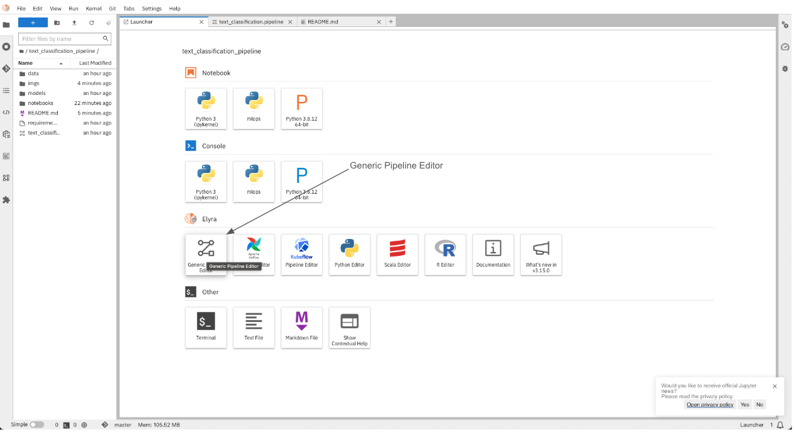

# Text Classification Pipeline

1. After installing Elyra with the requirements.txt, click on *Generic Pipeline Editor*

2. Select the *notebook* option to create notebook pipelines and drag notebooks that you want to include in the pipeline

